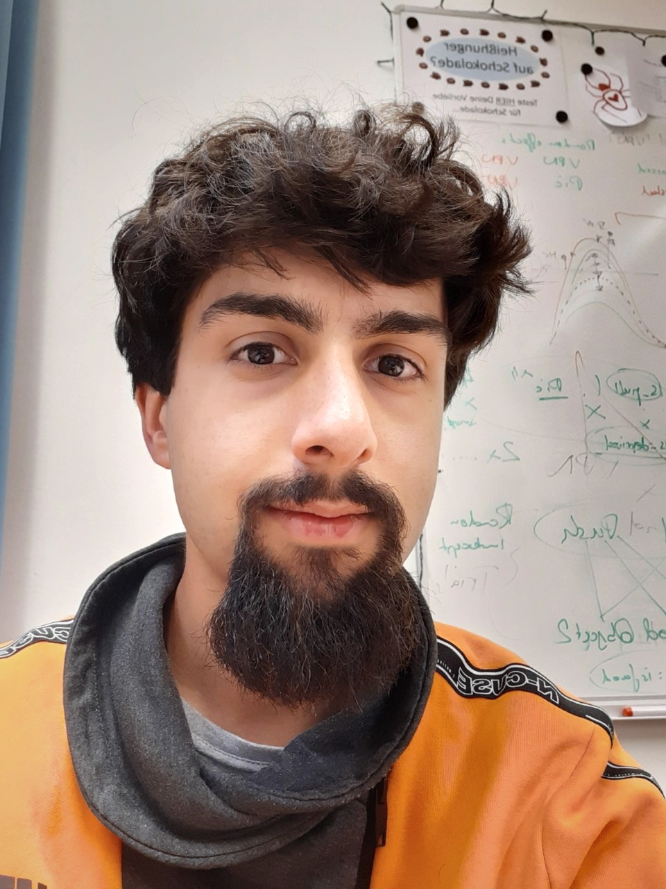

<link rel="stylesheet" href="styles.css" type="text/css">

I am a PhD student in the lab of Jens Blechert as part of the Eating Behaviour Laboratory. I focus on the development and analysis of the Approach-Avoidance Task (AAT). 

### Research Interests

My research interests include: 

* Psychological processes that initiate and maintain (maladaptive) behaviour

* Trial-level analysis of experimental data using multilevel analysis and bootstrapping

* Development of R programming and analysis packages